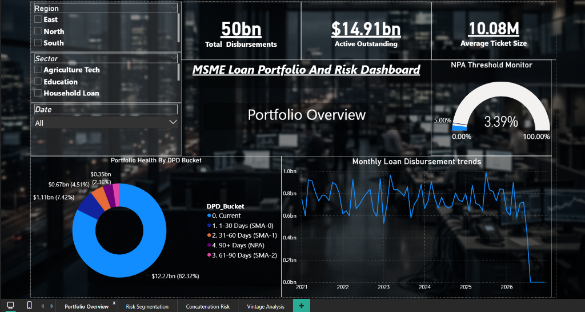
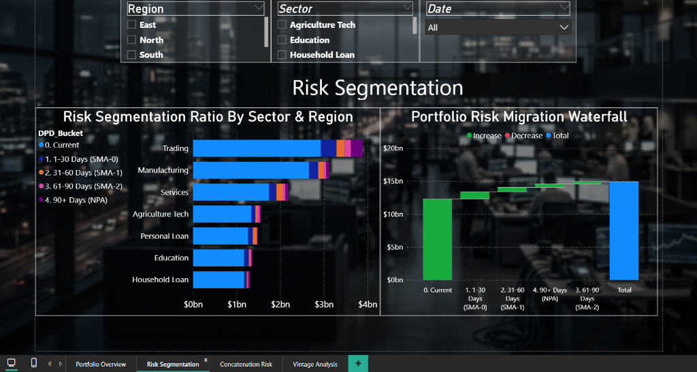
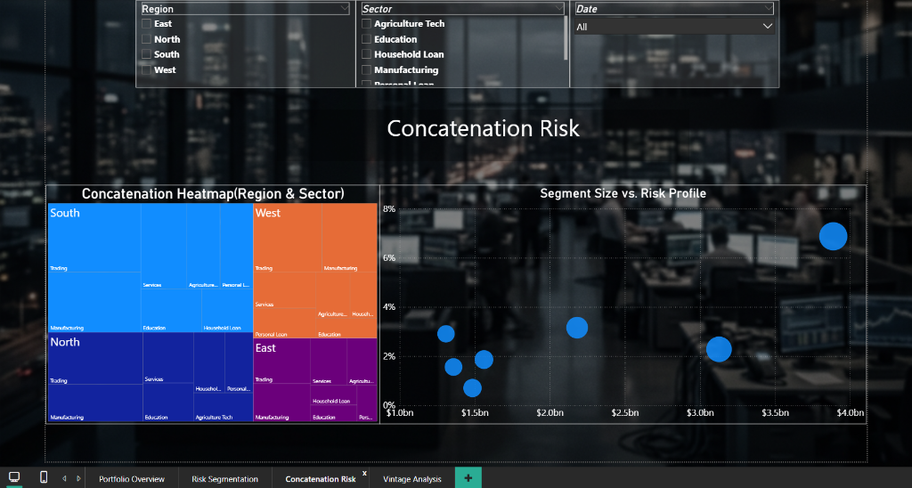
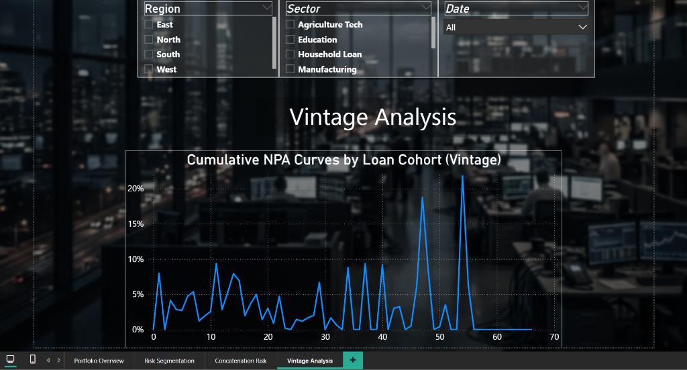

<div align="center">
  
</div>

# MSME Credit Risk & Portfolio Early Warning System

Welcome to the **MSME & NBFC Credit Risk Analytics Dashboard** project. This is a comprehensive, end-to-end data analytics and risk management project designed to simulate a real-world commercial lending portfolio for a Non-Banking Financial Company (NBFC) operating across India. 

The dashboard provides executives and risk managers with critical insights into portfolio health, exposure concentration, risk migration, and default trends using advanced risk metrics such as **PAR (Portfolio At Risk)**, **NPA (Non-Performing Assets)**, and **Risk-Adjusted Yield**.

---

## 📈 Key Dashboard Features

### 1. Executive Portfolio Overview
*   **Exposure at Default (EAD) Tracker:** Real-time visibility into the total active outstanding book (₹250Cr+ Cap).
*   **Dynamic NPA KPI Cards:** Tracks overall portfolio defaults (NPA %) compared to a target threshold of **5.00%** using visual color triggers (Red/Green).
*   **Disbursement Trends:** Interactive line charts mapping monthly disbursement volumes.

### 2. Early Warning & Risk Segmentation
*   **Risk Segmentation Ratio (100% Stacked Bar Chart):** Breaks down the outstanding book by Days Past Due (DPD) buckets (Current, SMA-0, SMA-1, SMA-2, NPA) across different industry sectors.
*   **Portfolio Risk Migration (Waterfall Chart):** Illustrates how loans flow from healthy statuses to defaults.

### 3. Concentration Risk Analytics
*   **Portfolio Concentration Heatmap (Treemap):** Visualizes exposure concentration across Indian geographic regions and sectors, making it easy to identify over-exposure (such as the injected risk in the *Trading* sector in the *East* region).
*   **Segment Size vs. Risk Profile (Scatter Plot):** Correlates segment size with default rates to isolate critical risk points.

### 4. Vintage Cohort Analysis
*   **Cumulative NPA Curves (Vintage Lines):** Compares different loan cohorts (e.g., 2021 vs. 2023 disbursements) at the exact same age (**Months on Book - MOB**) to detect early signs of underwriting decay.

---

## 🖥️ Dashboard Page Previews

Here is the completed 4-page interactive dashboard:

### Page 1: Portfolio Overview (Executive Summary)
*Provides a high-level summary of exposure, disbursements, average ticket sizes, and threshold alerts for executive leadership.*
<div align="center">
  
</div>

### Page 2: Risk Segmentation & Early Warning
*Breaks down risk status across different segments using a 100% stacked bar chart and tracks status migration using a waterfall chart.*
<div align="center">
  
</div>

### Page 3: Concentration Risk Profile
*Visualizes exposure concentration across sectors and regions using a treemap, and tracks segment size vs. risk correlation using a scatter plot.*
<div align="center">
  
</div>

### Page 4: Vintage Cohort Analysis
*Shows vintage loss curves to compare default trends of different cohorts at identical points in their lifecycle (Months on Book).*
<div align="center">
  
</div>

---

## 🛠️ Tech Stack & Architecture

*   **Data Engineering:** `Python` (`pandas`, `numpy`) inside Jupyter Notebooks.
*   **Financial Math:** Exact loan amortization formulas for calculating remaining principal balances row-by-row.
*   **Business Intelligence & Modeling:** `Power BI Desktop`.
*   **Data Modeling:** Relational Star Schema (Fact Table linked to a custom DAX Calendar Table).
*   **Calculations:** Advanced `DAX` formulas guarded by `COALESCE` to prevent chart blanking during granular slicer filtering.

---

## 🔢 Core DAX Formulas Implemented

To ensure the dashboard is robust when users drill down into very specific combinations (e.g., Region = West, Sector = Education), all core metrics are protected against blank values:

*   **Total Outstanding Portfolio:**
    ```dax
    Total_Outstanding = COALESCE(SUM('MSME_Loan_Portfolio'[Outstanding_Principal]), 0)
    ```
*   **Portfolio At Risk (PAR 30 %):**
    ```dax
    PAR30_Amount = COALESCE(CALCULATE([Total_Outstanding], 'MSME_Loan_Portfolio'[Days_Past_Due] > 30), 0)
    PAR30_% = COALESCE(DIVIDE([PAR30_Amount], [Total_Outstanding], 0), 0)
    ```
*   **Non-Performing Assets (NPA %):**
    ```dax
    NPA_Amount = COALESCE(CALCULATE([Total_Outstanding], 'MSME_Loan_Portfolio'[Days_Past_Due] > 90), 0)
    NPA_% = COALESCE(DIVIDE([NPA_Amount], [Total_Outstanding], 0), 0)
    ```
*   **Risk-Adjusted Yield:**
    ```dax
    Average_Interest = COALESCE(AVERAGE('MSME_Loan_Portfolio'[Interest_Rate]), 0)
    Risk_Adjusted_Yield = [Average_Interest] - ([NPA_%] * 0.50)
    ```
*   **Months on Book (Loan Age):**
    ```dax
    Months_on_Book = DATEDIFF('MSME_Loan_Portfolio'[Disbursement_Date], DATE(2026,7,19), MONTH)
    ```

---

## 🚀 How to Set Up & Run the Project

### Prerequisites
Make sure you have the following installed:
*   Python 3.x
*   Jupyter Notebook (or VS Code with Jupyter extension)
*   Power BI Desktop

### 1. Generate the Synthetic Dataset
1. Open the Jupyter Notebook `main.ipynb` in your editor.
2. Run the notebook cells. This runs a Python script that generates `MSME_Loan_Portfolio.csv` in the workspace folder.
3. The dataset simulates **5,000 active loans** spanning **2021 to 2026** with precise amortization schedules.

### 2. Open the Power BI Dashboard
1. Double-click the `MSME NBFC portfolio.pbix` file.
2. Click **Refresh** in the top menu to sync the dashboard with the newly generated CSV.
3. Import the custom background image `bg_realistic_office_1784306906819.png` in the Canvas Background settings at 0% transparency if it is not already loaded.

---

## 👨‍💻 Author

**Atharv Shukla**  
*Aspiring Data Analyst*

Passionate about transforming complex financial and operational data into interactive, decision-ready business intelligence. Focused on banking analytics, portfolio health metrics (PAR/NPA modeling), and building automated data pipelines from Python-based simulations to Power BI visualization.

*   **GitHub:** [@atharvshukla76](https://github.com/atharvshukla76)
*   **LinkedIn:** [linkedin.com/in/atharvshukla](https://linkedin.com/in/atharvshukla76) *(Please update with your actual link if needed!)*

